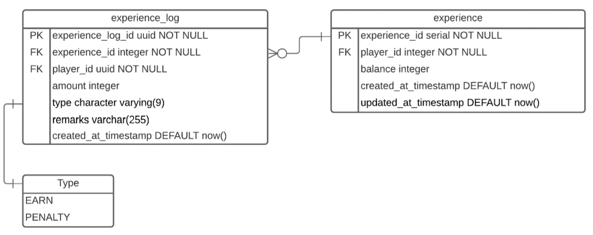
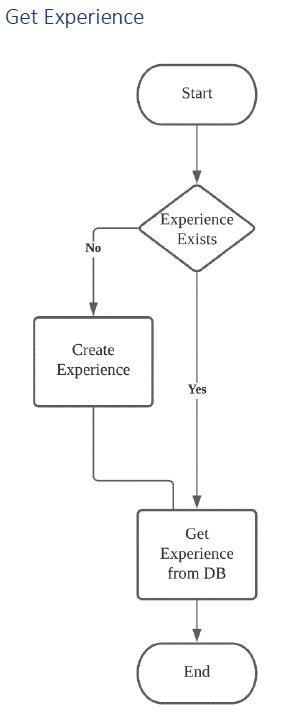
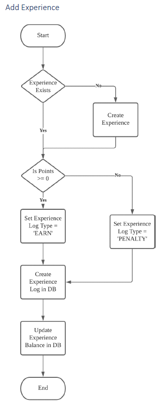

# docker-spring-boot-postgres
 A experience management Spring Boot application with a PostgreSQL database to run inside a Docker container.

# Setup and Test Instructions
1. Download the folder and run Command Prompt in the project root folder.
2. Run command: "docker-compose up --build" and the Spring Boot application and PostgreSQL should be running in the Docker.
3. Import "PostmanAPI_test.postman_collection.json" to your Postman and test. 

## Technology Stack
- Spring Boot Framework
- Hibernate
- RESTful APIs
- Docker
- Jave
- Postgres

## Main Function
The module was created to support the function of an experience points module in a microservice architecture.

## Entities/Database Design

## Flow

## APIs
Please refer to the following OpenAPI 3.0:
(https://app.swaggerhub.com/apis/ethanchangbd/ExperiencePoints/1.0.0-oas3)

